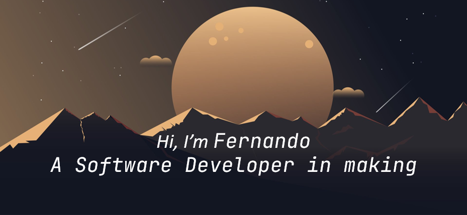

[](https://github.com/LuisTorres9606)

<p align="center">
    <a href="https://code.visualstudio.com/">
        
    </a>
    <a href="https://developer.mozilla.org/pt-BR/docs/Web/HTML">
        
    </a>
    <a href="https://developer.mozilla.org/pt-BR/docs/Web/CSS">
        
    </a>
    <a href="https://developer.mozilla.org/en-US/docs/Web/JavaScript">
        
    </a>
    <a href="https://getbootstrap.com">
        
    </a>
    <a href="https://www.python.org">
        
    </a>
    <a href="https://flask.palletsprojects.com/en/2.0.x/">
        
    </a>
    <a href="https://docs.microsoft.com/en-us/dotnet/csharp/">
        
    </a>
    <a href="https://www.java.com/es/">
        
    </a>
    <a href="https://git-scm.com">
        
    </a>
    <a href="https://github.com">
        
    </a>
    
</p>
<details>
    <summary align="center"> More... </summary>
    <h1 align="center"> Personal Information</h1>


```python
class Nando9606:

    def __init__(self):
        self.username = 'Nando9606'
        self.NAME = 'Fernando Torres'
        self.email = 'nando9606@gmail.com'
        self.twitter = 'nando9606'
        self.job = 'None'
        self.level = 'Junior Developer'
        self.knowledge = {
            'fronted':  ['HTML','CSS','JavaScript','Boostrasp'],
            'backend':  ['Python','Flask'],
            'code' :    ['C#','Java'],
            'database': ['SQL'],
            'tools':    ['GIT','GitHub'],
            'misc':     ['SCRUM']
        }
        self.architecture = ['MVC', 'Capas']

    def __str__(self):
        return self.NAME, self.level, self.job


if __name__ == '__main__':
    me = Nando9606()
    print(Nando9606().__str__()) # Looking for a job

```
    
<h3 align="center">About me:</h3>

<p align="center">
  <a href="https://instagram.com/nando9606">
    
  </a>
  <a href="https://twitter.com/nando96">
    
  </a>
  <a href="https://discord.gg/NandoTc9606#2627">
    
  </a>
  <a href="https://www.linkedin.com/in/fernando-torres-calderón-88589b123/">
    
</p>
</details>
<h1></h1>

<p align="center">Copyright © 2022 Fernando Torres Calderón</p>
